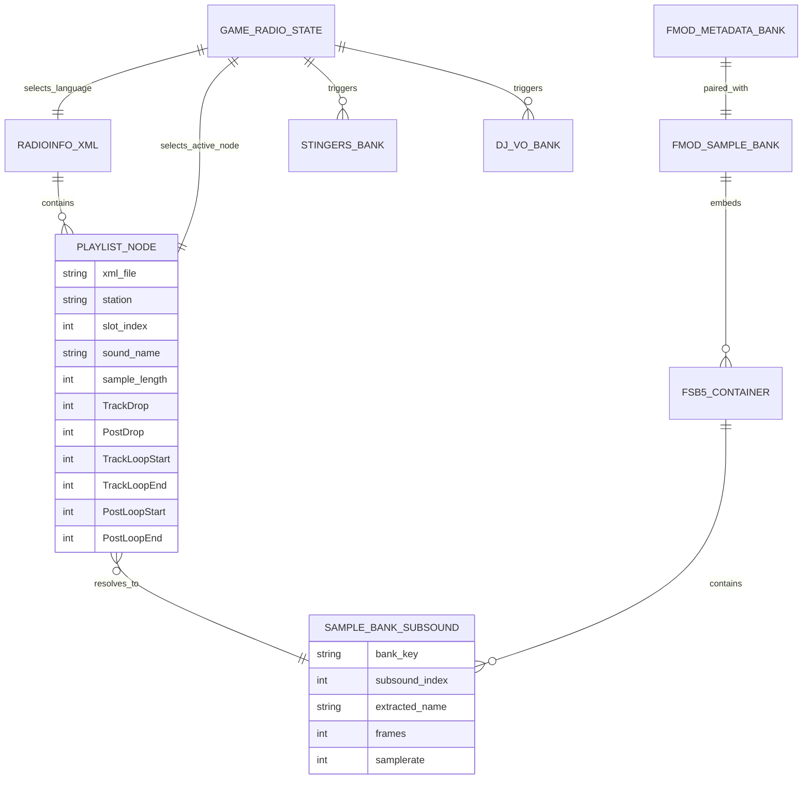
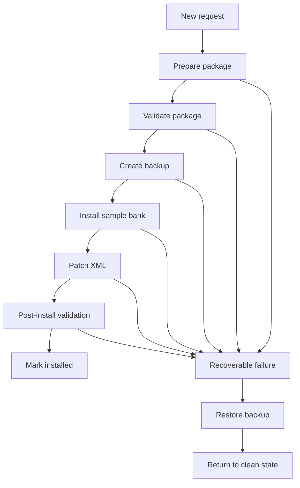

# FH6 Radio System Technical Report and Tool Operation Guide

## Executive Summary

The FH6 radio stack is best modeled as a **language-specific XML playlist layer** on top of a **split FMOD bank layer**: the XML picks station entries and timing metadata, while FMOD banks provide the runtime metadata and sample payloads needed to actually play music, dialogue, and stingers. FMOD’s own documentation confirms that banks can separate metadata from sample data, that strings banks are sample-free path/GUID lookup tables, and that FSB sound banks are multi-subsound containers selected by index rather than by friendly filename. citeturn3view0turn3view1turn3view2turn9view0turn10view0

Local analysis of the supplied developer CSVs shows a **paired-bank layout** that strongly fits that model: 2,801 bank files were indexed, 1,400 base names had both `.bank` and `.assets.bank` peers, and 1,226 banks yielded extractable audio. The radio-facing XML side contains 10 language files and 318 playlist rows per language, all at 48 kHz in the supplied tables. The most important operational result is that **marker values must be written in the coordinate system of the final prepared WAV**, not the source file, and XML patching must be **node-scoped** by XML file, station, and slot rather than by `sound_name` alone.

The supplied tables also expose the main failure classes that matter for tooling: title-token false positives that map songs to SFX, duplicate `sound_name` values reused across different station contexts with different sample lengths, and a small set of language-specific anomalies in `RadioInfo_CN.xml`. The safest replacement workflow is therefore to preserve bank order, rebuild or splice only the `.assets.bank` sample payload, normalize markers from the final prepared WAV, and validate every patched XML node before deploy.

## Scope and Evidence Base

This report is based on two evidence classes. The first is the supplied developer output tables, which were provided here as CSV files and analyzed locally as generic CSV data. The second is FMOD’s official documentation and support guidance, used only for the parts that concern FMOD bank behavior, FSB behavior, time-unit semantics, and FSBank tool behavior. citeturn3view0turn3view2turn3view3turn9view0turn11view0turn11view2

The supplied project artifacts available in this session were:

| Supplied file | Operational role in this report |
|---|---|
| `all_bank_extract_statistics.csv` | Per-bank scan summary: role hints, extractability, audio counts, durations |
| `bank_extract_status.csv` | Extract outcome log for extractable banks |
| `fmod_all_bank_audio_inventory.csv` | Extracted subsound inventory: bank key, subsound index, frames, samplerate, duration |
| `music_bank_inventory.csv` | Condensed inventory of long-audio banks relevant to song replacement |
| `target_all_station_soundnames.csv` | Parsed target playlist rows from `RadioInfo_*.xml` |
| `xml_to_bank_mapping.csv` | Ranked XML-to-bank candidate mapping output |
| `dev_all_station_soundname_summary.csv` | Station-level mapping summary |
| `missing_track_candidate_shortlist.csv` | Manual-review candidate shortlist for ambiguous cases |
| `dev_all_station_soundname_search.csv` | Wider search candidate output behind the summary/mapping tables |

Two limits matter. First, no raw XML files or source code were included in a queryable form in this session, so XML element names beyond the table fields are treated generically as “playlist nodes” or “track nodes.” Second, the exact game-side event names that trigger DJ VO and stingers are not exposed directly by these CSVs, so the event-routing parts of this report are necessarily **inferred from the bank inventory and runtime behavior**, not from a published FH6 schema.

## FH6 Radio Runtime Model

FMOD’s model is the right baseline for understanding FH6. A bank can contain the metadata and sample data needed for playback, and FMOD explicitly allows metadata and sample data to be built into separate banks. FMOD also distinguishes a **strings bank** as a special bank that contains path-to-GUID lookup data but never sample data, and a **master bank** as the holder of the global mixer and related project-wide structures. citeturn3view0turn3view1turn3view2

The FH6 output tables are consistent with that model. Local analysis found that almost every banked asset appears as a base-name pair:

- `Something.bank`
- `Something.assets.bank`

In the supplied scan, the `.assets.bank` side is typically the extractable, sample-carrying side, while the peer `.bank` side usually behaves as metadata-dominant or non-audio in this workflow. That is an inference, but it matches FMOD’s documented metadata/sample separation model very closely. The local scan also found a singleton `MasterBank.strings.bank`, which aligns with FMOD’s documented strings-bank role. citeturn3view0turn3view1

Operationally, the FH6 radio path can be described like this:

1. The game chooses a **language**, which selects one `RadioInfo_<LANG>.xml`.
2. The game chooses a **radio mode/state**: normal station playback, Streamer Mode, menu/press-start, 3D/global radio, and likely cruise/race/post-race sub-states.
3. The game chooses a **playlist node** inside the active XML context. That node supplies `sound_name`, `sample_length`, and marker fields such as `TrackDrop`, `TrackLoopStart`, and `PostLoopStart`.
4. The runtime then resolves that choice to sample data located in one or more FMOD sample banks.
5. DJ VO and stingers appear to be triggered by **event-side logic and radio state**, not by the same XML track-row mechanism used for normal songs.

That last point is important. The supplied mapping tables cover normal station song rows very well, but the DJ VO and stinger banks do not appear as ordinary `RadioInfo_*` song rows. This strongly suggests that music playback is XML-guided, while DJ/stinger playback is FMOD-event guided.



The most important inference from the local XML tables is that **the game cannot be keying song playback by `sound_name` alone**. In the supplied data, 82 `sound_name` values appear in two station contexts, and 27 of those repeated `sound_name` values have **different** `sample_length` values depending on context. Streamer Mode is the clearest case: it behaves as its own 82-slot playlist and reuses material from other stations, often with alternate lengths. The tool must therefore patch and validate the **actual active node**, not any globally matching `sound_name`.

A practical corollary follows from the earlier user-reported `IsXCloudModeSafe` issue: when XML contains duplicate-looking attribute blocks or multiple near-identical nodes, the patcher must either identify the canonical runtime node or update all runtime-relevant duplicates consistently. Treating the XML as a flat text-replace target is not safe enough.

## Bank Inventory and Sample-Bank Relationships

Local analysis of `all_bank_extract_statistics.csv` and `fmod_all_bank_audio_inventory.csv` found the following headline structure:

- **2,801** bank files scanned
- **1,226** extractable banks
- **1,575** skipped or non-extractable banks
- **125,763** extracted subsounds
- **1,400** paired base names with both `.bank` and `.assets.bank`
- **1** singleton `MasterBank.strings.bank`

The radio-relevant extractable categories are:

| Local category | Extractable banks | Total subsounds | Typical duration range | Interpretation |
|---|---:|---:|---|---|
| `tracks_bank` | 12 | 237 | 31.967s to 371.500s | Main song carriers used by station playlists |
| `stingers_bank` | 90 | 900 | 9.755s to 18.161s | Per-station, per-language stinger/jingle pools |
| `dj_vo_bank` | 90 | 16,772 | 5.050s to 56.720s | Per-station, per-language DJ voice banks |
| `glb_radio_3d` | 1 | 42 | 87.771s to 235.789s | Global/3D radio pool; important in Streamer linkage |
| `press_start_music` | 1 | 1 | 260.369s | Main menu / press-start music bank |
| `horn_sfx` | 142 | 142 | 0.373s to 13.705s | SFX, plus false-positive risk during text-based matching |
| `horn_musical` | 47 | 48 | 2.240s to 8.931s | Musical horn content, not station songs |
| `voice_other` | 350 | 98,845 | 0.050s to 28.076s | Broader voice inventory outside radio song flow |

The music-bearing part of the inventory is narrower than the bank name list initially suggests. Local analysis of `music_bank_inventory.csv` found 16 long-audio banks worth immediate radio-tool attention:

- `R1_Tracks_CU1.assets` and `R1_Tracks_Disk.assets`
- `R2_Tracks_CU1.assets` and `R2_Tracks_Disk.assets`
- `R3_Tracks_CU1.assets`
- `R4_Tracks_CU1.assets`
- `R5_Tracks_Disk.assets`
- `R6_Tracks_CU1.assets`
- `R7_Tracks_CU1.assets`
- `R8_Tracks_CU1.assets`
- `R9_Tracks_CU1.assets`
- `R10_Tracks_Disk.assets`
- `GLB_Radio_3D.assets`
- `GLB_RadioPressStart.assets`
- `GLB_Snapshots.assets`
- `GLB_VideoPlayer.assets`

The supplied stats also show many bank names that **look** radio-related but carry no extractable audio in this workflow, including several `CU2`, `PDLC`, and `R10_Stingers_<LANG>` assets. That means filename heuristics are useful only as first-pass hints. The authoritative mapping is the empirical XML-to-bank mapping, not the regex alone.

The main empirical bank-pattern map is:

| Bank filename pattern | Local category | Typical role in FH6 | Typical XML linkage |
|---|---|---|---|
| `R[1-9]_Tracks_CU1.assets.bank` | Track sample bank | Primary song carriers for most stations | Directly referenced by song rows in `RadioInfo_*.xml` |
| `R[1-9]_Tracks_Disk.assets.bank` | Track sample bank | Secondary/overflow song carriers | Directly referenced by some song rows |
| `R10_Tracks_Disk.assets.bank` | Track sample bank | Special/orphan long-audio bank in current scan | No rank-1 `RadioInfo_*` mapping observed in supplied tables |
| `R[1-9]_Stingers_[LANG].assets.bank` | Stingers bank | Localized station idents/jingles | Usually event/state driven, not normal song-row XML |
| `R10_Stingers_[LANG].assets.bank` | Stingers hint only | Present by name, zero extractable audio in supplied scan | None observed |
| `VO_DJ_[1-9]_[LANG].assets.bank` | DJ VO bank | Localized DJ speech for each station | Event/state driven, not normal song-row XML |
| `GLB_RadioPressStart.assets.bank` | Global music bank | Main menu / press-start music | Not part of ordinary station playlists |
| `GLB_Radio_3D.assets.bank` | Global 3D radio bank | Global or alternate radio content, important for Streamer/manual-review cases | Sometimes appears in Streamer-related candidate mapping |
| `Horn_SFX_*.assets.bank` | SFX bank | Horns and short effects | No normal song-row linkage; high false-positive risk in text matching |
| `Horn_Musical_*.assets.bank` | Musical horn bank | Novel short musical content | No normal song-row linkage |
| `MasterBank.strings.bank` | Strings bank | Event path/GUID lookup | No sample data by design in FMOD strings-bank model |

FMOD’s Core API explains why **subsound order** is a hard requirement. FSB files can contain many sounds in one file, and FMOD selects those subsounds by index through `Sound::getSubSound`; the valid index range is `[0, getNumSubSounds())`. That means friendly extracted filenames such as `sound_0.wav`, `sound_1.wav`, and so on are not cosmetic: they reflect the runtime selection index, so replacement must preserve count and ordering. citeturn9view0turn10view0

This is exactly why a direct `fsbankcl + splice` route is attractive but must be handled carefully. FMOD officially supports FSB creation through FSBank and ships `fsbank.exe` and `fsbankcl.exe`; the current FSBank API writes FSB5. At the same time, FMOD has stated publicly that **there is no public FSB5 format specification**, that FSB5 Vorbis is not plain Ogg Vorbis with a simple wrapper, and that producing compatible bitstreams requires FMOD’s tools or libraries. citeturn3view3turn5search0turn1search3turn9view0

## Marker Semantics and Normalization

The supplied XML target tables strongly indicate that FH6’s song timing fields are authored in **sample coordinates**, not pure seconds. Every row in `target_all_station_soundnames.csv` uses `sample_rate = 48000`, and the mapped inventory durations are numerically consistent with `frames / 48000`, rounded to milliseconds. That fits FMOD’s own time-unit model: one PCM sample corresponds to `1 / sample_rate` seconds, and FMOD documents direct conversions between samples, milliseconds, and bytes. FMOD also defines `lengthpcm`, `loopstart`, and `loopend` in **samples**, which is the strongest general-model match for the marker fields used by FH6. citeturn11view2turn11view0

The safest operational definitions are:

| Field | Operational meaning in FH6 tooling | Recommended authored unit | XML write unit | Validation rule |
|---|---|---|---|---|
| `TrackDrop` | Preferred punch-in anchor for the main track context | Seconds or samples in UI | Samples | `0 <= TrackDrop < SampleLength` |
| `PostDrop` | Preferred punch-in anchor for the alternate/post context | Seconds or samples in UI | Samples | `0 <= PostDrop < SampleLength` |
| `TrackLoopStart` | Main loop start for the normal track state | Seconds or samples in UI | Samples | `< TrackLoopEnd` |
| `TrackLoopEnd` | Main loop end for the normal track state | Seconds or samples in UI | Samples | `<= SampleLength` |
| `PostLoopStart` / `PostRaceLoopStart` | Alternate loop start for post-race / post-state playback | Seconds or samples in UI | Samples | `< PostLoopEnd` |
| `PostLoopEnd` / `PostRaceLoopEnd` | Alternate loop end for post-race / post-state playback | Seconds or samples in UI | Samples | `<= SampleLength` |
| `SampleLength` | Total length of the prepared audio | Derived only | Samples | `== final prepared frame count` |
| `End` | Playback endpoint in the same coordinate family as `SampleLength` | Derived only | Usually samples | Normally `== SampleLength` unless proven otherwise |
| `Duration` | Human-readable duration field, if present | Derived only | Seconds or ms depending node schema | Never hand-author from stale source data |

Because exact FH6 XML element definitions were not supplied here, `End` and `Duration` should be treated as **field-metadata-driven outputs**, not hard-coded assumptions. The core principle remains unchanged: **every sample-position field must be normalized against the final prepared WAV**.

The normalization rules should be:

- If the UI stores a marker in **seconds**:  
  `final_marker = round(marker_seconds * final_sample_rate)`

- If the UI stores a marker in **source-sample coordinates** and the prepared WAV changed length:  
  `final_marker = round(source_marker * final_total_samples / source_total_samples)`

- If the source sample rate changed but the authoring UI stayed time-based, always prefer recomputation from seconds over reusing stale sample counts.

This is the recommended normalization pseudocode:

```text
function normalize_track_markers_for_prepared_audio(track_cfg, source_audio, prepared_audio):
    result = {}
    warnings = []

    final_rate = prepared_audio.sample_rate
    final_samples = prepared_audio.total_samples

    if source_audio.total_samples > 0:
        scale = final_samples / source_audio.total_samples
    else:
        scale = null

    for field in [
        "TrackDrop", "PostDrop",
        "TrackLoopStart", "TrackLoopEnd",
        "PostLoopStart", "PostLoopEnd",
        "PostRaceLoopStart", "PostRaceLoopEnd"
    ]:
        value = track_cfg.get(field)
        if value is null:
            continue

        unit = track_cfg.marker_unit(field)   # "seconds" or "samples"

        if unit == "seconds":
            normalized = round(value * final_rate)
        else if scale is not null and track_cfg.marker_basis == "source_audio":
            normalized = round(value * scale)
        else:
            normalized = round(value)

        normalized = clamp(normalized, 0, final_samples - 1)
        result[field] = normalized

    result["SampleLength"] = final_samples
    result["End"] = final_samples
    result["DurationSeconds"] = final_samples / final_rate

    validate_pairs(result, warnings)
    return result, warnings
```

The most common marker failure modes are all visible in recent user reports and in the supplied tables:

- **Resampling or padding** changes final sample counts but XML markers are left stale.
- **Song names reused across contexts** tempt developers to patch by `sound_name` instead of by active node.
- **Exact-length false matches** can send a track into the wrong bank role.
- **Loop preview and final bank payload disagree** because the player previews source audio while XML is written from prepared audio.

Your tool should therefore preview, compute markers, and export/import marker CSVs against the **same prepared WAV** object that will finally be banked.

## Replacement Workflows

The four workflows below assume a disciplined package flow: backup first, prepare audio second, rebuild bank third, patch XML only if needed, validate, then deploy.

**Replacing songs**

1. Identify the target row using `xml_file + station + slot_index + sound_name`. Do not key by `display_name`.
2. Find the bank mapping from your empirical mapping tables, not only from the bank filename regex.
3. Convert the source track into a **prepared WAV** with the format your current replacement route accepts reliably. In current FH6 practice, that usually means 48 kHz stereo PCM WAV so the prepared file matches the radio inventory and avoids downstream format drift.
4. Compute the final sample count from the prepared WAV.
5. Normalize all song markers from the prepared WAV.
6. Rebuild the target `.assets.bank` using either:
   - **Fmod Bank Tools route**: extract all subsounds, replace the target subsound by index, rebuild;
   - **FSBank route**: rebuild a matching FSB and splice it into the `.assets.bank`.
7. Patch the active XML node(s) with `SampleLength`, `End`, and normalized marker values.
8. Validate bank order, XML node count, and marker ranges before installing.

Required files usually include one `RadioInfo_<LANG>.xml`, the target `.assets.bank`, and often its peer `.bank` for backup completeness. Common failure modes are malformed XML from a previous mod, stale sample counts, or writing only one of several runtime-relevant duplicate nodes.

**Replacing SFX**

1. Use the full bank inventory to locate the exact SFX bank and subsound index.
2. In most cases, **do not patch `RadioInfo_*`** unless the SFX is explicitly referenced there.
3. Preserve the original count, order, and approximate transient behavior; short effects are more sensitive to encoder artifacts and silence padding than songs are.
4. Rebuild or splice the `.assets.bank`.
5. Validate by auditioning in-game trigger paths, not by song preview tools.

Common failure modes are overlong replacement tails, clipped onsets, or channel/format drift.

**Replacing stingers**

1. Target `R[1-9]_Stingers_<LANG>.assets.bank`. The supplied scan found 90 extractable stinger banks with exactly 10 subsounds each.
2. Assume the **subsound index order is semantic** and preserve it exactly.
3. XML patching is generally not part of this workflow unless additional subtitle or presentation metadata exists outside the supplied tables.
4. Rebuild or splice the `.assets.bank`, then test that the station still triggers the correct ident/jingle moments.

The main failure here is duration/cadence mismatch: even when audio replacement succeeds technically, the station pacing can feel wrong if the replacement stinger is too long or too short.

**Replacing VO_DJ**

1. Target `VO_DJ_[1-9]_<LANG>.assets.bank`.
2. Preserve subsound count and ordering exactly. The supplied scan found 90 extractable DJ VO banks with 124 to 247 subsounds per bank.
3. Do not assume ordinary `RadioInfo_*` patching applies; current evidence points to event-driven routing.
4. Rebuild or splice the sample bank and validate in the correct station and language.

The main failure is not bank corruption but **behavioral mismatch**: lines may play too long, overlap other radio elements, or break host cadence even if the bank is technically valid.

For all four scenarios, the backup policy should be the same:

- Back up the original XML file
- Back up the target `.assets.bank`
- Back up the peer `.bank` if present
- Record hashes and deployment state before overwrite

## Findings from Developer Output Tables

Local analysis of the supplied CSVs produces a fairly clear empirical picture of FH6 radio content.

The XML side consists of **10 language files**:

- `RadioInfo_BR.xml`
- `RadioInfo_CN.xml`
- `RadioInfo_DE.xml`
- `RadioInfo_EN.xml`
- `RadioInfo_ES.xml`
- `RadioInfo_IT.xml`
- `RadioInfo_JP.xml`
- `RadioInfo_KO.xml`
- `RadioInfo_MX.xml`
- `RadioInfo_TW.xml`

Each language contains **318 target rows** divided as follows:

| Station | Slots per language |
|---|---:|
| Horizon Pulse | 36 |
| Horizon Bass Arena | 29 |
| Horizon Block Party | 26 |
| Horizon XS | 25 |
| Hospital Records | 25 |
| Gacha City Radio | 25 |
| Sub Pop Records | 23 |
| Horizon Wave | 25 |
| Horizon Opus | 22 |
| Streamer Mode | 82 |

The mapping tables show that the current station-song matching is overwhelmingly **length-driven**, not name-driven. In `dev_all_station_soundname_summary.csv`, every station reports `name_hit_targets = 0`; all matched targets were resolved by length candidates. In the rank-1 slice of `xml_to_bank_mapping.csv`, 3,120 rows are `length_candidate` and 60 are `text_hint`. That is a strong signal that sample length is the dominant join key for ordinary songs.

A concise empirical station-to-bank map is:

| Station | Primary mapped bank(s) | Notable note |
|---|---|---|
| Horizon Pulse | `r1_tracks_cu1.assets`, `r1_tracks_disk.assets` | One false-positive text hint to `glb_ambience.assets` for “777” |
| Horizon Bass Arena | `r2_tracks_cu1.assets`, `r2_tracks_disk.assets` | One false-positive text hint to `horn_sfx_tape_rewind.assets` |
| Horizon Block Party | `r3_tracks_cu1.assets` | One false-positive text hint to `horn_sfx_spec_speed.assets` |
| Horizon XS | `r4_tracks_cu1.assets` | Clean in rank-1 mapping |
| Hospital Records | `r5_tracks_disk.assets` | One false-positive text hint to `horn_sfx_falling.assets` |
| Gacha City Radio | `r6_tracks_cu1.assets`, plus 3 rows in `r5_tracks_disk.assets` | Bank prefix is not always a reliable station proxy |
| Sub Pop Records | `r7_tracks_cu1.assets` | Clean in rank-1 mapping |
| Horizon Wave | `r8_tracks_cu1.assets`, plus 1 row in `r3_tracks_cu1.assets` | Another cross-bank exception |
| Horizon Opus | `r9_tracks_cu1.assets` | Clean in rank-1 mapping |
| Streamer Mode | Aggregates many banks, mostly `r8/r4/r2/r1/r7/r6/r9` plus `glb_radio_3d.assets` | Distinct composite playlist, not a simple alias |

The most important anomalies are these:

| Problem class | Local finding | Practical impact | Recommended fix |
|---|---|---|---|
| Title-token false positives | 6 unique rank-1 mislinks across languages (`777`, `Rewind`, `Speed`, `Falling`) | Songs can map to ambience/SFX banks instead of music banks | Apply a hard role prior and minimum-duration gate before accepting text hits |
| Duplicate `sound_name` across contexts | 82 `sound_name` values occur in two station contexts; 27 of them carry different `sample_length` values | Patching by `sound_name` alone can update the wrong runtime node | Key XML patches by `xml_file + station + slot_index + sound_name` |
| `RadioInfo_CN.xml` anomalies | Gacha City Radio slots 19–21 use different `sample_length` values than the other languages | Cross-language assumptions can produce incorrect candidate selection and stale markers | Treat each language XML independently |
| Manual-review shortlist skew | `missing_track_candidate_shortlist.csv` contains 1,360 rows for 68 unique targets; 1,114 rows point to `glb_radio_3d.assets` | Streamer/GLB content can flood candidate selection | Separate Streamer/GLB heuristics from normal station banking |
| Zero-audio radio-looking banks | Multiple `CU2`, `PDLC`, and `R10_Stingers_*` names exist with zero extractable audio | Regex-only routing will produce dead ends | Skip zero-sound banks in replacement candidate generation |

The `RadioInfo_CN.xml` anomalies deserve special attention. Local analysis found three Gacha City Radio rows where the Chinese XML carries different `sample_length` values than the corresponding rows in the other nine language files:

- slot 19: `HZ6_R6_TEKETEKE_GotokuLemon`
- slot 20: `HZ6_R6_YellowMagicOrchestra_Technopolis`
- slot 21: `HZ6_R6_DEDEMOUSE_SkyscraperStarlight`

That is enough evidence to reject any patching strategy that assumes one `sound_name` has one global sample length across all XMLs.

## Tool Design, Validation, and Legal Guardrails

The most useful tool changes are the ones that directly absorb the findings above.

**Implementation recommendations**

The minimum function set to add or harden is:

- `normalize_track_markers_for_prepared_audio(track_cfg, source_audio_info, prepared_audio_info)`
- `write_radioinfo_xml_safely(xml_path, stable_track_key, normalized_fields)`
- `validate_radioinfo_nodes(xml_path, stable_track_key)`
- `build_fsb_with_fsbank(subsounds, output_fsb, format_opts)`
- `splice_fsb5_into_assets_bank(original_assets_bank, replacement_fsb, target_fsb_index)`
- `emit_progress_jsonl(event_dict)`
- `export_marker_csv(rows)`
- `import_marker_csv(csv_path)`

The current safety model should be explicit and stateful:



The progress/logging protocol should be JSONL, not free-form strings, so the UI can stay compact while logs remain machine-auditable. A good minimal shape is:

```json
{"ts":"2026-05-26T12:00:00Z","event":"step_started","step":"prepare_audio","track_key":"RadioInfo_EN.xml|Horizon Pulse|16|HZ6_R1_Joji_777"}
{"ts":"2026-05-26T12:00:02Z","event":"warning","step":"map_bank","reason":"candidate_role_mismatch","candidate_bank":"glb_ambience.assets","length_diff":6335120}
{"ts":"2026-05-26T12:00:08Z","event":"step_completed","step":"build_fsb","output":"prepared.fsb"}
{"ts":"2026-05-26T12:00:12Z","event":"step_completed","step":"patch_xml","updated_nodes":2}
```

The marker export/import schema should be stable-keyed and prepared-audio-aware:

| Column | Purpose |
|---|---|
| `xml_file` | Language XML scope |
| `station` | Station scope |
| `slot_index` | Stable playlist index |
| `sound_name` | Stable song identifier, but not sole key |
| `display_name` | Human-readable label |
| `bank_name` | Current mapped bank |
| `source_audio_path` | Original imported asset |
| `source_total_samples` | Source coordinate basis if known |
| `source_sample_rate` | Source sample rate |
| `prepared_audio_path` | Final WAV actually banked |
| `prepared_total_samples` | True write basis for XML |
| `prepared_sample_rate` | Usually 48000 |
| `SampleLength` | Derived final length |
| `TrackDrop` | Marker |
| `PostDrop` | Marker |
| `TrackLoopStart` | Marker |
| `TrackLoopEnd` | Marker |
| `PostLoopStart` | Marker |
| `PostLoopEnd` | Marker |
| `PostRaceLoopStart` | Alias marker if used |
| `PostRaceLoopEnd` | Alias marker if used |
| `gain_db` | Applied gain during prep |
| `notes` | Operator notes |

That schema prevents the exact stale-marker problem seen in field reports, because the export includes both the **source basis** and the **prepared basis**.

The waveform/player behavior should also become prepared-audio-centric. The player should use **Play / Pause / Resume**, not Play / Stop / Reset as the default interaction model. The waveform should be generated from the prepared WAV, not the source asset, because that is the file whose sample count controls XML writing. The progress display should show:

- playhead position
- waveform peaks or RMS bins
- vertical markers for `TrackDrop` and `PostDrop`
- shaded loop ranges for `TrackLoop*` and `PostLoop*`
- active-loop highlighting during preview

If waveform generation fails, the fallback should be a normal seek bar, but seeking must still work both while paused and while playing.

The `fsbankcl + FSB5 splice` route has the strongest long-term upside, but it should be treated as a controlled adapter around official FMOD tooling, not a speculative reimplementation of FMOD internals. FMOD officially ships `fsbank.exe` and `fsbankcl.exe`, FSBank writes FSB5, and FMOD has also stated that FSB5’s public specification is not available and that compatible Vorbis bitstreams require FMOD tools or libraries. citeturn3view3turn5search0turn1search3turn9view0

A practical comparison is:

| Route | Advantages | Risks |
|---|---|---|
| Fmod Bank Tools GUI automation | Already familiar; can work with minimal reverse-engineering | Window-focus fragility, opaque failures, poor CI/headless support |
| `fsbankcl + FSB5 splice` | Deterministic, headless, structured logging, easier validation | FSB5 spec is not public; bank container surgery must preserve subsound order and outer container sizes |

The safe XML patch pseudocode should look like this:

```text
function write_radioinfo_xml_safely(xml_path, stable_key, normalized):
    doc = parse_xml_preserving_order(xml_path)
    nodes = find_track_nodes(doc, stable_key)   # xml_file/station/slot_index/sound_name

    if nodes is empty:
        raise PatchError("target node not found")

    for node in nodes:
        update_if_present(node, "SampleLength", normalized["SampleLength"])
        update_if_present(node, "End", normalized["End"])
        for field in marker_fields:
            if field in normalized:
                update_if_present(node, field, normalized[field])

    write_temp_file(doc)
    reparse_temp_for_validation()
    replace_atomically(xml_path, temp_path)
```

The sample-bank splice pseudocode should stay conservative:

```text
function splice_fsb5_into_assets_bank(original_bank, replacement_fsb, target_fsb_index):
    original_bytes = read_binary(original_bank)
    fsb_regions = locate_all_fsb5_regions(original_bytes)

    assert target_fsb_index in range(len(fsb_regions))

    old_region = fsb_regions[target_fsb_index]
    old_fsb = parse_fsb5_header(original_bytes[old_region.start:old_region.end])
    new_fsb = parse_fsb5_header(read_binary(replacement_fsb))

    assert old_fsb.num_subsounds == new_fsb.num_subsounds
    assert old_fsb.sample_order == new_fsb.sample_order

    new_bytes = replace_slice(original_bytes, old_region.start, old_region.end, read_binary(replacement_fsb))
    new_bytes = fix_outer_container_sizes_if_needed(new_bytes)

    write_temp_binary(new_bytes)
    validate_fsb_signatures(temp_file)
    replace_atomically(original_bank, temp_file)
```

**Validation and acceptance tests**

The validation set should be concrete and repeatable:

| Test type | Test | Method | Expected result |
|---|---|---|---|
| Unit | Marker normalization from seconds | Feed known marker seconds and prepared WAV info | Output samples equal `round(sec * sample_rate)` |
| Unit | Marker scaling from source samples | Feed source/prepared sample mismatch | Output scales correctly and clamps safely |
| Unit | XML duplicate patch scope | Patch one repeated `sound_name` existing in two contexts | Only the intended node(s) update |
| Integration | Song rebuild | Replace one known song in a multi-subsound bank | Bank loads, target song changes, others remain intact |
| Integration | Stinger rebuild | Replace one stinger subsound | Station still triggers idents cleanly |
| Integration | DJ VO rebuild | Replace one VO subsound | Language/station line plays and cadence is tolerable |
| Integration | Restore path | Force an install-time failure after backup | Restore returns original XML and banks |
| Manual | In-game loop validation | Listen through loop segments | Loop start/end match player preview closely |
| Manual | Streamer Mode validation | Test a duplicated song in Streamer Mode | Correct node is affected, not the base-station entry only |

Useful sample commands for prepared WAV verification are:

```bash
python - <<'PY'
import wave, sys, json
with wave.open(sys.argv[1], 'rb') as w:
    frames = w.getnframes()
    rate = w.getframerate()
    channels = w.getnchannels()
    bits = w.getsampwidth() * 8
print(json.dumps({
    "frames": frames,
    "sample_rate": rate,
    "channels": channels,
    "bits": bits,
    "duration_sec": frames / rate
}, indent=2))
PY prepared.wav
```

```bash
python - <<'PY'
import sys
data = open(sys.argv[1], 'rb').read()
print("FSB5 signatures:", data.count(b'FSB5'))
print("First FSB5 offset:", data.find(b'FSB5'))
PY R1_Tracks_CU1.assets.bank
```

A generic XML verification pass can be as simple as:

```bash
python - <<'PY'
import sys, xml.etree.ElementTree as ET

xml_path = sys.argv[1]
sound_name = sys.argv[2]

tree = ET.parse(xml_path)
root = tree.getroot()

for elem in root.iter():
    attrs = elem.attrib
    if attrs.get("SoundName") == sound_name or attrs.get("sound_name") == sound_name:
        print(elem.tag, attrs)
PY RadioInfo_EN.xml HZ6_R1_CRi_HoldYou
```

If parsing fails here, that is already a deployment failure: the XML is malformed and should be restored or repaired before anything else.

**Security, legal, and licensing guardrails**

No third-party source code should be copied into the tool unless its license is explicit and compatible. This matters especially for unofficial FSB5 parsers or any external radio-modding project. The safest pattern is to treat FMOD tools as **external adapters**: detect a user-supplied `fsbankcl.exe` or Bank Tools installation, invoke it as a subprocess, record versions and command lines in JSONL, and keep your own project code limited to orchestration, validation, and patch logic.

That recommendation is strengthened by FMOD’s own statements: FSB5 has no public specification, and compatible Vorbis payloads require FMOD tools or libraries. In practice, that means reverse-engineered readers may be perfectly suitable for validation and inventory work, but **encoding and final bank production should prefer official FMOD binaries whenever possible**. citeturn1search3turn3view3turn5search0turn9view0